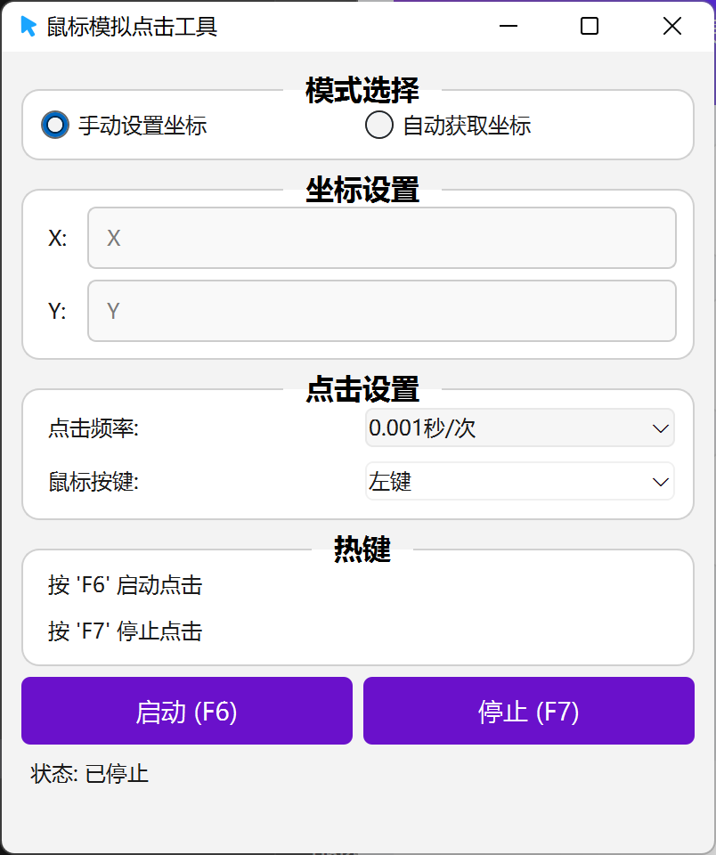
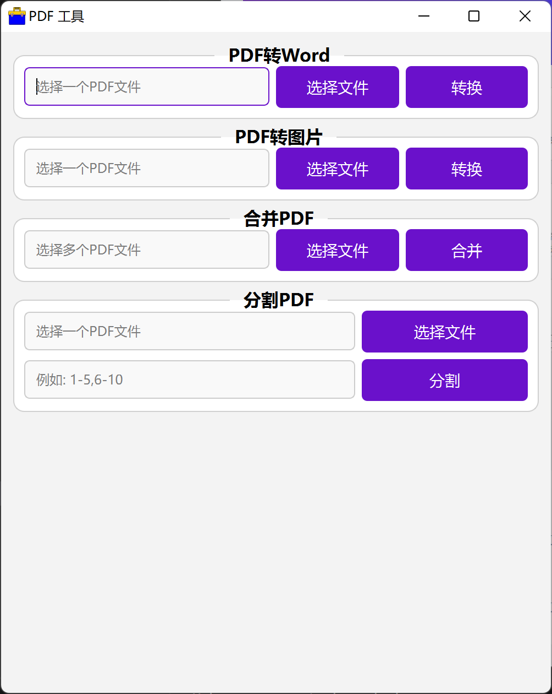
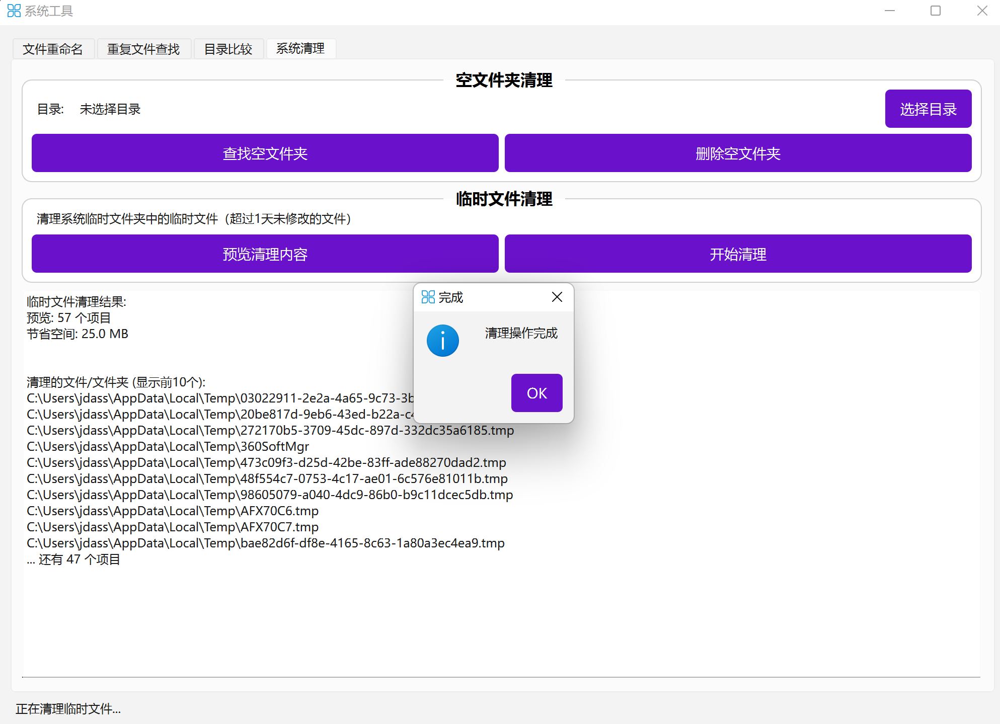

# 多功能工具箱

一个基于PyQt6的多功能桌面应用工具箱，集成13个专业工具类别，提供PDF处理、图片编辑、音视频处理、鼠标自动化、文本处理、系统工具、网络工具、加密解密、开发者工具、办公效率、媒体增强和数据分析等全方位功能。








## 特别说明

1. 本程序未经过任何测试（哪怕一次小小的点击操作都没有进行过），功能应该存在很多问题。
2. 该程序完全开源免费，任何贩卖与本人无任何关系。
3. 欢迎二次开发，乐见其成。

## 功能特性

### 📄 PDF工具
- PDF转Word/Excel转换
- PDF合并与分割
- PDF压缩优化
- PDF页面提取

### 🖼️ 图片工具
- 格式转换（支持主流格式）
- 智能压缩与批量处理
- 精确裁剪与尺寸调整
- 水印添加与EXIF信息读取
- 图片拼接与滤镜效果
- 批量重命名与旋转翻转

### 🎵 音频工具
- 多格式转换（MP3/WAV/FLAC等）
- 音频剪辑与合并
- 音量调节与音质优化

### 🎬 视频工具
- 视频格式转换
- 视频剪辑与合并
- 视频压缩与质量优化

### 🖱️ 鼠标工具
- 鼠标自动化操作
- 热键绑定与坐标记录
- 点击序列录制与回放

### 📝 文本处理
- 编码转换（UTF-8/GBK/ASCII等）
- 批量查找替换（支持正则）
- 文本分割合并与统计分析

### 🔧 系统工具
- 重复文件查找（MD5校验）
- 批量文件重命名
- 目录对比与系统清理

### 🌐 网络工具
- 二维码生成与识别
- URL批量测试
- 端口扫描与网络诊断
- HTTP文件服务器

### 🔐 加密解密
- AES文件加密/解密
- 文本加密与哈希计算
- 密码生成器

### ⚙️ 开发者工具
- JSON/XML格式化与验证
- URL/Base64/HTML编解码
- 正则表达式测试
- 颜色工具与调色板

### 📊 办公效率
- Excel处理（合并/分割/转换）
- 高级批量重命名
- 文件监控与剪贴板管理
- 目录结构分析

### 🎨 媒体增强
- 专业截图工具（区域/延时/标注）
- GIF制作与优化
- 条形码生成
- 图片拼贴与画廊

### 📈 数据分析
- CSV数据分析与质量报告
- 数据清洗与标准化
- 多格式转换（CSV/Excel/JSON/HTML）
- 日志分析与数据透视表
- 数据可视化图表生成

## 环境要求

- Python 3.8+
- PyQt6
- Windows 10/11（推荐）

## 安装依赖

```bash
pip install -r requirements.txt
```

## 运行程序

```bash
python main.py
```

## 打包为可执行文件

```bash
pyinstaller main.spec
```

## 技术栈

### 核心框架
- **界面框架**: PyQt6（带标签页和多线程操作）

### 文件处理
- **PDF处理**: PyMuPDF, pdf2docx, python-docx
- **图片处理**: Pillow（支持EXIF信息）
- **音频处理**: pydub
- **视频处理**: moviepy

### 系统与网络
- **系统信息**: psutil
- **网络请求**: requests
- **二维码**: qrcode[pil]
- **自动化**: pynput
- **版本管理**: semver

### 加密与安全
- **加密解密**: cryptography（AES和RSA）

### 数据处理与分析
- **数据操作**: pandas, numpy
- **数据可视化**: matplotlib, seaborn
- **Excel处理**: openpyxl

### 办公与效率
- **文件监控**: watchdog
- **剪贴板**: pyperclip
- **条形码**: python-barcode[images]

## 项目架构

### 核心应用结构
- **main.py**: 主入口，自适应网格布局，支持13个工具类别
- **utils.py**: PyInstaller兼容的资源路径工具
- **styles.qss**: Qt样式表，应用主题
- **data_manager.py**: 使用统计数据管理
- **update_manager.py**: GitHub版本检查与自动更新

### 窗口模块（UI层）
```
窗口模块/
├── pdf_window.py        # PDF处理界面
├── image_window.py      # 图片编辑界面
├── audio_window.py      # 音频处理界面
├── video_window.py      # 视频处理界面
├── mouse_window.py      # 鼠标自动化控制
├── text_window.py       # 文本处理分析界面
├── system_window.py     # 系统工具界面
├── network_window.py    # 网络工具界面
├── crypto_window.py     # 加密解密工具界面
├── dev_window.py        # 开发者工具界面
├── office_window.py     # 办公效率工具界面
├── media_window.py      # 媒体增强工具界面
└── data_window.py       # 数据分析工具界面
```

### 工具模块（业务逻辑）
```
工具模块/
├── pdf_utils.py         # PDF操作（转换/合并/分割/压缩）
├── image_utils.py       # 增强图片处理（格式转换/压缩/裁剪/水印/EXIF/批处理/滤镜/旋转翻转/图片拼接）
├── audio_utils.py       # 音频处理（格式转换/编辑/音量控制）
├── video_utils.py       # 视频处理（格式转换/编辑/压缩）
├── mouse_utils.py       # 鼠标自动化和热键处理，支持动态坐标
├── text_utils.py        # 文本处理（编码转换/查找替换/分割合并/分析）
├── system_utils.py      # 系统工具（重复文件查找/批量重命名/目录对比/系统清理）
├── network_utils.py     # 网络工具（二维码生成/URL测试/端口扫描/HTTP服务器/网络诊断）
├── crypto_utils.py      # 加密解密操作（AES文件加密/哈希计算/密码生成）
├── dev_utils.py         # 开发者工具（JSON/XML格式化/编解码/正则测试/颜色工具）
├── office_utils.py      # 办公效率（Excel处理/文件监控/剪贴板管理/目录分析）
├── media_utils.py       # 媒体增强（截图工具/GIF制作/条形码生成/图片拼贴）
├── data_utils.py        # 数据分析（CSV分析/数据清洗/日志分析/透视表）
└── zip_utils.py         # 归档文件操作
```

### 配置与资源
```
配置资源/
├── main.spec           # PyInstaller打包配置
├── requirements.txt    # 项目依赖
├── styles.qss         # 界面样式
├── data/
│   └── usage_stats.json # 使用统计数据
└── *.png              # 工具图标资源
```

## 版本信息

**当前版本**: v1.0.9

### 最新更新特性
- ✨ 完整的13个工具类别，专业化UI设计
- 🖱️ 增强的鼠标自动化，支持热键和坐标记录
- 📊 高级数据分析功能，包含数据透视表和可视化
- 🔐 全面的加密解密工具，支持多种哈希算法
- ⚙️ 专业开发者工具，JSON/XML处理和正则测试
- 🎨 媒体增强工具，截图标注和GIF优化
- 📋 办公效率套件，Excel处理和文件监控
- 📈 实时使用统计追踪，数据持久化存储
- 🔄 GitHub自动更新检查和安装

### 技术亮点
- 🧵 多线程处理，UI不阻塞
- 📦 PyInstaller单文件分发
- 🎯 模块化架构，易于扩展
- 🔒 安全的文件处理
- 🌍 中文本地化界面